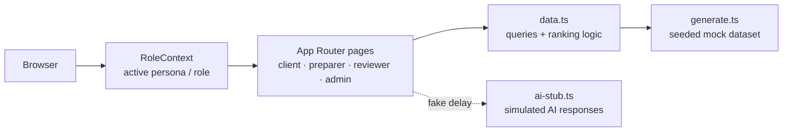

# GreenGrowth

A prototype tax-prep platform for **GreenGrowth CPAs** — a from-scratch client/CPA workflow product covering document intake, AI-assisted review, cross-role collaboration, and filing status, designed around one question: *what does someone actually need to do next?*

Built as a take-home product/design exercise: 10 open-ended design challenges, no prescribed UI, no backend requirement. It's a real, clickable Next.js app, not a static mockup — but everything behind the UI is intentionally simulated. See below for exactly where that line is.

**Live: https://greengrowth-tax-platform-pi.vercel.app**

---

## Architecture



No API layer, no database — `data.ts` plays the role a repository layer over a real DB would, just synchronous and in-memory. One example, because "single source of truth" is a claim worth showing, not just asserting:

```ts
// lib/mock/types.ts — one state machine, rendered two ways (client label vs. staff label)
// off the same record, so the two audiences can't drift apart from each other.
export const STATUS_META: Record<ReturnStatus, StatusMeta> = {
  awaiting_documents: {
    clientLabel: "Action needed: upload your documents",
    staffLabel: "Awaiting Documents (Client)",
    ownerRole: "client",
    blocking: true,
    milestone: 0,
  },
  // ...6 more statuses, same shape
};
```

`StatusPill` and `StatusProgress` both just read this object — neither one hardcodes a label.

---

## What's genuinely wired up vs. simulated

**Real:** the Next.js app end to end — routing, all UI logic, the role-based permission system (enforced consistently across every path into a return, not just in the nav), the prioritization/ranking algorithms behind the dashboard, the status/progress state machine above, search/filter/pagination against a 249-document dataset, and the deep-linking/back-navigation trail connecting messages → tasks → documents → fields.

**Simulated, by design** — this is what "keep it quick and dirty, simulate the AI" meant in practice for a 10-challenge take-home, not a shortcut I'd defend for production:

| What | How it's faked | Why it's OK here |
|---|---|---|
| AI / LLM | `ai-stub.ts` returns hand-authored JSON behind an artificial delay | The interaction model was being judged, not extraction accuracy — the seam is real, the model behind it isn't |
| Document OCR | Viewer renders a layout templated by doc type (W-2/1099 boxed fields, receipt line items, bank statement rows) from data already on the record | No real file exists to parse in the first place |
| Backend / DB | Everything generated once at process start (`generate.ts`), queried in-memory (`data.ts`) | Explicitly out of scope; a "write" (upload, send, edit) updates local React state and is gone on refresh |
| Auth | Account switcher over 8 fixed demo users, persona persisted via `localStorage` | No real session needed for a role-architecture demo |

### Decisions worth explaining

- **Two roles built in full** (Client, Preparer); Reviewer and Firm Admin are lighter, adapted views of the same shell rather than two more fully independent UIs. Six roles as six separate products defeats the point of the exercise — the interesting problem is one architecture flexing across roles.
- **Business-owner and seasonal-staff are variations, not separate builds** — Elena Rivera's client view on a business return (same role, different data shape), Jordan Osei's preparer account with a visibly reduced permission set.
- **The dashboard's urgency ranking is a plain rules-based sort** (blocking status, then nearest real deadline, pulling in task-level due dates), not a scored model — a small script over mock data is the right amount of engineering for what's being evaluated.
- **Category taxonomy for Rivera's generated documents is keyed deterministically to vendor type**, not drawn independently at random — an earlier pass let a utility bill land under "Income" purely by chance, the kind of bug that looks fine in a demo and wrong the moment someone clicks around.

---

## Quick start

**Prerequisites:** Node 20+, npm.

```bash
git clone https://github.com/ayantikanandi18/greengrowth-tax-platform.git
cd greengrowth-tax-platform
npm install
npm run dev
```

Open **http://localhost:3000**. No environment variables, no `.env` file, no database to provision. If port 3000 is already taken locally, Next.js picks the next free port and prints it to the terminal — use whatever it reports.

```bash
npm run build   # production build
npm run start   # serve the production build locally (after build)
npm run lint    # eslint
```

No test suite — verification was done by hand against each of the 10 design challenges (typecheck + lint clean, then click-through per feature), not automated tests, given the scope and timeline.

---

## Deploying

Standard Next.js App Router project — any platform with first-class Next.js support works. Actually deployed to **Vercel**:

**Dashboard, no CLI:**
1. Push the repo to your own GitHub account.
2. [vercel.com/new](https://vercel.com/new) → import it. Framework auto-detects as Next.js.
3. No environment variables to configure — leave that section empty and deploy.
4. Every push to `main` after that auto-deploys via Vercel's GitHub integration.

**CLI:**
```bash
npm i -g vercel
vercel login
vercel --prod
```
Accept the inferred defaults (Next.js, build command `next build`, output `.next`). `.vercel/` is gitignored on purpose — it's your own account's project link, not something to inherit from this repo.

---

## Project structure

```
src/
  app/                       Next.js App Router routes — one folder per URL
    client/                    Client-role screens: My Return, Documents, Messages, Questionnaire
    preparer/
      returns/[id]/              Per-return workspace — layout.tsx adds the Overview/Review/Documents/Messages tabs
    reviewer/, admin/          Lighter role-specific views, reusing the same components as preparer/client
    layout.tsx                 Root layout — wraps everything in RoleProvider + QuestionnaireProvider + AppShell
  components/                 Shared UI: AppShell, Sidebar, DataStateBadge, DocumentViewer,
                               AIInsightCard, StatusPill/StatusProgress, TaskList, BackToBanner
  lib/
    context/                   RoleContext (active persona/role, SSR-safe via useSyncExternalStore),
                               QuestionnaireContext (onboarding progress)
    mock/
      generate.ts                 All seed data — the "database" (seeded faker + hand-authored records)
      data.ts                      Query functions + business logic (ranking, status labels) over that data
      types.ts                     Shared TypeScript types, STATUS_META
      ai-stub.ts                   Fake AI response functions — see "What's simulated" above
```

Same shell (`AppShell` → `Sidebar`/`TopNav`) renders differently per role by reading `activeRole` from context — four route trees for four roles, not four separate apps stitched together.

---

## Demo accounts

Click the account switcher, top right. 8 logins across 4 roles:

| User | Role(s) | Why they exist |
|---|---|---|
| **Ayantika Nandi** | Preparer *and* Client | Primary preparer account — also has their own personal return, to demonstrate a firm employee who is also a client |
| **Jordan Osei** | Preparer (seasonal) | Same shell, genuinely reduced permissions — not just a banner |
| **Dana Whitfield** | Reviewer | Sees only returns in final review |
| **Alex Whitcombe** | Firm Admin | Firm-wide overview |
| **Sarah Chen** | Client | Individual return mid-review — the main traceability walkthrough |
| **Elena Rivera** | Client | Rivera Consulting LLC — a business return with 249 documents, for the scale/search challenge |
| **David Okafor** | Client | Blocked return (missing a document) — dashboard urgency example |
| **Priya Nair** | Client | Brand-new client, zero data — the first-time onboarding walkthrough |

---

## How this maps to the assignment

*(Described in my own words — not reproducing the brief's proprietary language, since the source document was marked confidential.)*

**Traceability** — `/preparer/returns/r-sarah-2025/review`
- Click any field → right panel shows the exact source document, the region on it, the transformation applied.
- Multi-source fields (wages = 2 W-2s, charity = 6 receipts) show a chip for **every** source, not just the first.
- Rivera Consulting has its own separate 5-field Schedule C set — a second, business-flavored example, not a one-off built only for Sarah.

**Client/CPA collaboration** — `/preparer/returns/[id]/messages`, `/client/messages`
- Internal-vs-client-visible toggle on every message.
- Messages link back to the specific document or task they're about, not just mentioned in text.
- Outstanding Requests groups threads and shows **who owns the next reply** — whoever didn't send the last message — plus a real "Mark resolved" action.

**First-time onboarding** — log in as **Priya Nair**
- Home screen shows exactly one action: a real 3-question intake form, not a task title.
- The Questionnaire nav item only exists while something's unanswered.
- Answering all three changes the interface live, same session: hero switches, nav item disappears, previously-hidden stat tiles appear.

**Cross-object navigation** — any return's Overview tab
- Global nav (`Sidebar`) stays constant; contextual nav (`ReturnTabs`) only exists inside a return.
- Most-specific link wins: a task about one field jumps straight to that field, pre-selected — not just the general tab.
- Real deep-linkable URLs (`?field=...&fromLabel=...&fromHref=...`) plus a "← Back to [task]" banner — bookmarkable, shareable, never loses your place.

**Role-aware experience** — same shell, different nav per role
- `ReturnTabs`/`ReturnShortcuts`/`ReturnTaskList`/`ReturnInsights` all filter by the same role rule set.
- A seasonal preparer can't reach a review action through *any* of 4 independent paths (tab, shortcut card, task link, inline AI-insight button) — verified separately, not assumed to generalize.
- A firm employee with a personal return switches identity from the same account; any list showing both her rows labels the personal one explicitly.

**Status & progress** — one state machine, two renderings
- `STATUS_META` (7 statuses) drives both a compact `StatusPill` and a full `StatusProgress` panel.
- Answers where/what's next/who owns it/blocked-or-not in one glance, not a hover tooltip.
- 7 internal statuses collapse to 4 client-facing milestones — staff-only nuance never leaks into the client's view.

**Actionable dashboard** — `/preparer`
- Ranked by blocking status, then nearest actual deadline — pulls in open-task urgency, not just the return's headline status.
- Individual preparers get it scoped to their own clients; managers get a firm-wide `/admin` view with a staff workload panel.

**Clickable vs. editable** — `DataStateBadge`
- One visual language (AI-suggested / verified / locked / needs-input) reused across 3 screens.
- "Locked" is clickable, not disabled — explains *why*, doesn't just refuse input.
- "Needs your input" is the one state that's genuinely editable — a real text input, not another inspectable card.

**Complexity at scale** — Rivera Consulting, 249 documents
- Search, category filters, newest-first sort, summary/detail toggle, pagination, click-through detail panel — all against the real dataset.
- Deep links into one specific document override both the summary-view default and the pagination window that would otherwise hide it.

**Trustworthy AI** — `AIInsightCard`
- What the AI found, a collapsible rationale, linked evidence, a confidence meter, accept/correct — all inline, no navigating away.
- The correction path is real: one field comes back with an actual different, explained value on recheck, and that correction updates the value shown, not just the explanation text.

---

## Stack

Next.js 16 (App Router) + TypeScript + Tailwind CSS v4, Framer Motion, `@faker-js/faker` for mock data generation.
